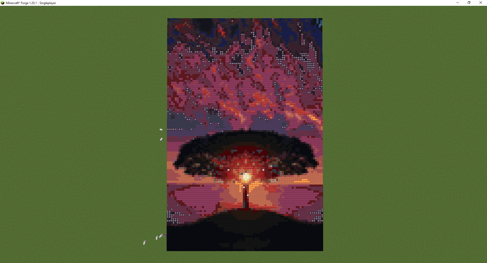
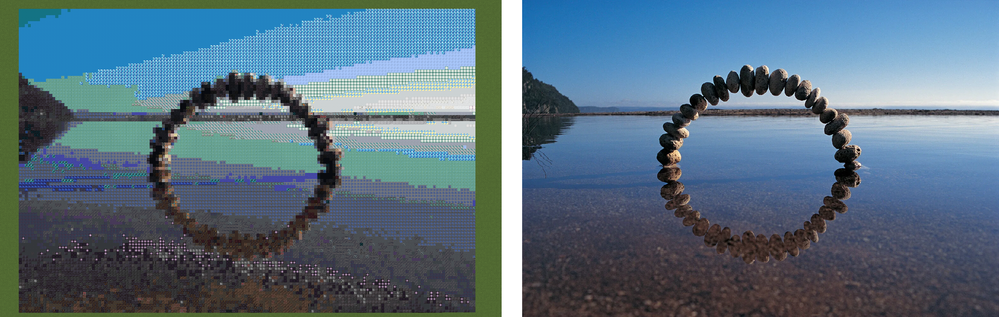

# Minecraft Image Map Generator

Convert your images into Minecraft worlds! This Next.js application takes any image and generates a Minecraft world where each pixel is represented by a Minecraft block, matched by color similarity.

## Features

- 🖼️ **Image to Minecraft World Conversion**: Upload any image and convert it into a playable Minecraft world
- 🎨 **Color Matching**: Automatically matches image colors to the closest Minecraft block colors
- 📦 **Complete World Package**: Generates a complete Minecraft world file (ZIP) ready to import
- 🖼️ **Preview Generation**: Creates a preview image showing how the final world will look
- ⚡ **Fast Processing**: Optimized image processing pipeline for quick generation
- 🎮 **Multiple Versions**: Supports multiple Minecraft versions (default: 1.21.1)

## Examples




## Tech Stack

- **Framework**: Next.js 15.5.5 with App Router
- **Language**: TypeScript
- **Image Processing**: Sharp
- **Minecraft**: Prismarine Chunk, Minecraft Assets, Minecraft Data
- **Styling**: Tailwind CSS 4
- **Code Quality**: Biome (linter & formatter)

## Getting Started

### Prerequisites

- Node.js 20+ 
- npm, yarn, pnpm, or bun

### Installation

1. Clone the repository:
```bash
git clone <repository-url>
cd mc-image-map
```

2. Install dependencies:
```bash
npm install
# or
yarn install
# or
pnpm install
```

3. Run the development server:
```bash
npm run dev
# or
yarn dev
# or
pnpm dev
```

4. Open [http://localhost:3000](http://localhost:3000) in your browser